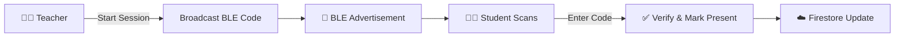

<div align="center">


# 🎓 Beykoz University App

### *Your Campus, In Your Pocket*

[](https://flutter.dev)
[](https://firebase.google.com)
[](https://dart.dev)

**The official mobile application for Beykoz University students, faculty, and staff**

[Features](#-features) • [Installation](#-getting-started) • [Technologies](#-tech-stack) • [Documentation](#-project-structure)

</div>

---

## ✨ Features

<table>
<tr>
<td width="50%" valign="top">

### 🎯 Core Features
- **🔐 Secure Authentication** - Firebase-powered login system
- **🏠 Personalized Dashboard** - Customizable home with favorite features
- **📰 Live News Feed** - Real-time university announcements
- **👤 Smart Profile** - Auto-synced from OIS with GPA tracking
- **💬 Messenger** - Built-in chat for campus communication

</td>
<td width="50%" valign="top">

### 🌟 Advanced Features
- **✔️ BLE Attendance** - Bluetooth-based check-in system
- **🌐 Integrated Portals** - In-app OIS & Online Beykoz access
- **👨‍🏫 Faculty Directory** - Browse staff profiles & CVs
- **🚌 Campus Services** - Transportation & contact info
- **⚙️ Admin Panel** - Complete management dashboard

</td>
</tr>
</table>

### 🎨 Customization Options

```
⭐ Favorites System    →  Pin your most-used features to the home screen
🌓 Theme Switcher      →  Seamless dark/light mode toggle
📱 Responsive Design   →  Optimized for all screen sizes
```

---

## 🛠️ Tech Stack

<div align="center">

| Category | Technologies |
|----------|-------------|
| **Framework** | Flutter (Cross-platform) |
| **Language** | Dart |
| **Backend** | Firebase (Auth + Firestore) |
| **State Management** | Provider Pattern |
| **BLE Communication** | flutter_reactive_ble |
| **Web Integration** | webview_flutter |
| **Local Storage** | Shared Preferences |

</div>

---

## 📁 Project Structure

```
beykoz-app/
│
├── 🤖 android/              # Android-specific code
│   └── MainActivity.kt      # BLE implementation
│
├── 🍎 ios/                  # iOS-specific code
│   └── AppDelegate.swift    # BLE implementation
│
├── 📱 lib/                  # Main application code
│   ├── main.dart           # App entry point
│   ├── Pages/              # All screen views
│   ├── Services/           # Business logic layer
│   ├── Widgets/            # Reusable components
│   └── Data/               # Static configurations
│
├── 🎨 assets/              # Images & resources
│   └── images/
│
├── 🧪 test/                # Unit & widget tests
├── 📦 pubspec.yaml         # Dependencies
└── 📖 README.md            # You are here!
```

---

## 🚀 Getting Started

### Prerequisites

- Flutter SDK 3.0 or higher
- Dart SDK 2.17 or higher
- Android Studio / Xcode (for mobile development)
- Firebase account

### Installation Steps

**1️⃣ Clone the Repository**
```bash
git clone <repository-url>
cd beykoz-app
```

**2️⃣ Verify Flutter Installation**
```bash
flutter doctor
```
*Need to install Flutter? [Follow the official guide →](https://docs.flutter.dev/get-started/install)*

**3️⃣ Configure Firebase**

Place your Firebase configuration files:
- **Android**: `google-services.json` → `android/app/`
- **iOS**: `GoogleService-Info.plist` → `ios/Runner/`
- Verify config in `lib/Services/firebase_options.dart`

**4️⃣ Install Dependencies**
```bash
flutter pub get
```

**5️⃣ Run the Application**
```bash
# For debug mode
flutter run

# For release build
flutter build apk  # Android
flutter build ios  # iOS
```

---

## 📸 Screenshots

<div align="center">

*Coming Soon - Stay Tuned!*

</div>

---

## 🎓 Attendance System Workflow



---

## 🤝 Contributing

We welcome contributions! Here's how you can help:

1. 🍴 Fork the repository
2. 🌿 Create your feature branch (`git checkout -b feature/AmazingFeature`)
3. 💾 Commit your changes (`git commit -m 'Add some AmazingFeature'`)
4. 📤 Push to the branch (`git push origin feature/AmazingFeature`)
5. 🔃 Open a Pull Request

---

## 📄 License

This project is proprietary software developed for Beykoz University.

---

## 📞 Support & Contact

<div align="center">

**Need Help?**

📧 Email: erenkaynak180@gmail.com

---

<sub>Made with ❤️ for Beykoz University Community</sub>

</div>